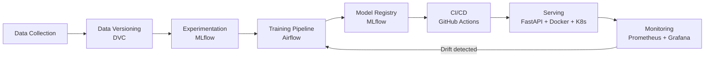

<h1 align="center">Hi 👋, I'm Md Estiak Rahman Ayon</h1>

  Software & ML enthusiast — building data-driven applications and shipping models to production.

  
  
  
  
  

---

## 🧑‍💻 About Me

- 🔭 Currently working on **machine learning projects and end-to-end MLOps pipelines**
- 🌱 Learning **model deployment, experiment tracking, and CI/CD for ML**
- 💬 Ask me about **Python, machine learning, web development, and data visualization**
- 📫 Reach me at **estiakayon@gmail.com**

> _Edit the four lines above — they're placeholders based on your stack, not facts about you._

---

## ⚙️ MLOps

The part of ML that isn't the model: getting it into production and keeping it healthy there.

**What each stage covers**

| Stage | Purpose | Tools I use |
|---|---|---|
| Data versioning | Reproducible datasets tied to each commit | DVC, Git LFS |
| Experiment tracking | Compare runs, params, metrics, artifacts | MLflow |
| Orchestration | Scheduled, retryable training pipelines | Apache Airflow |
| Packaging | Reproducible environments and images | Docker, Conda |
| CI/CD | Test, build, and deploy on every merge | GitHub Actions, GitLab CI |
| Serving | Low-latency inference endpoints | FastAPI, Kubernetes |
| Monitoring | Latency, throughput, data & concept drift | Prometheus, Grafana |

**Practices I follow**

- Every experiment is reproducible: pinned dependencies, versioned data, logged seeds
- Models are promoted through a registry (staging → production), never copied by hand
- Training and serving share the same preprocessing code to avoid train/serve skew
- Rollback is a one-command operation, and monitoring decides when to retrain

### 🧰 MLOps Toolkit

---

## 💻 Tech Stack

**Languages**

**Machine Learning & Data**

**Web & Frameworks**

**Databases**

**Tools & Other**

---

## 📊 GitHub Stats

  

  

  

---

  

